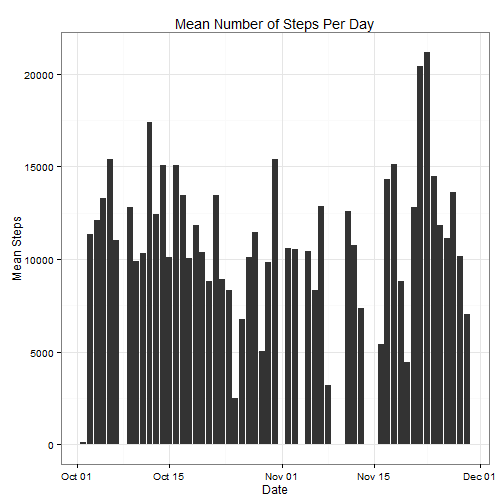

## Loading and preprocessing data

Note: We assume the datafile is in the current working directory.

Transformations made:
- Coerce steps to numerics
- Corce date column to a datetime


```r
unzip("activity.zip")
activity_data <- read.csv(file="activity.csv", header = T, stringsAsFactors=F)
activity_data$steps <- as.numeric(activity_data$steps)
activity_data$date  <- as.Date(activity_data$date, format="%Y-%m-%d")
```

## Mean number of steps per day


```r
library(ggplot2)
library(scales)
library(dplyr, quietly=TRUE, warn.conflicts=FALSE)

summary_data <- group_by(activity_data, date) %>%
    summarise(mean_steps=mean(steps), median_steps=median(steps))

ggplot(activity_data, aes(x=date, y=steps)) + geom_histogram(stat="identity") + 
    theme_bw() + ylab("Mean Steps") + xlab("Date") + 
    ggtitle("Mean Number of Steps Per Day")
```

```
## Warning: Removed 2304 rows containing missing values (position_stack).
```

 

The assignment text is unclear on whether an individual mean & median is wanted 
for each date as a standalone entity or a single mean & median for the entire 
dataset. Forum postings seem to indicate the latter, which are a mean of 37.3825996 and a median of 
0. The per-day mean and medians are in 
the `summary_data` object, not displayed here but 
calculated.


## Average daily activity pattern

```r
by_interval <- activity_data %>% 
    group_by(interval, add = FALSE) %>% 
    summarise(step_mean=mean(steps, na.rm=T))
ggplot(by_interval, aes(x=interval, y=step_mean)) + geom_line() + theme_bw() +
    ggtitle("Mean Number of Steps Per Interval") + ylab("Mean Steps") + 
    xlab("Interval") 
```

 

The maximum mean interval period is period 
835.

## Imputing missing values
There are 2304 NAs in the data set. For this 
assignment, we are imputing missing values based upon the mean number of steps 
taken in the interval.

```r
activity_data <- left_join(activity_data, by_interval, by=c("interval"))
activity_data[is.na(activity_data$steps), c("steps")]  <- 
    activity_data[is.na(activity_data$steps), c("step_mean")]
summary_data <- group_by(activity_data, date) %>% 
    summarise(mean_steps=mean(steps), median_steps=median(steps))
ggplot(activity_data, aes(x=date, y=steps)) + geom_histogram(stat="identity") +
    theme_bw() + ggtitle("Steps with Imputed Data") + 
    ylab("Mean Imputed Steps") + xlab("Date")
```

 


Again the assignment text is unclear on whether an individual mean & median is 
wanted for each period as a standalone entity or a single mean & median for the 
entire dataset. The overall mean of the imputed data set is 37.3825996 and the median is 
0. The per-day mean and medians are in 
the `summary_data` object, not displayed here but 
calculated.

## Differences between weekdays and weekends

```r
library(timeDate)
activity_data$weekday <- as.factor(isWeekday(activity_data$date))
levels(activity_data$weekday) <- c("Weekend", "Weekday")
by_interval <- activity_data %>% 
    group_by(weekday, interval, add = FALSE) %>% 
    summarise(step_mean=mean(steps, na.rm=T))
ggplot(by_interval, aes(x=interval, y=step_mean)) + geom_line() + 
    facet_grid(weekday ~ .) + theme_bw() + 
    ggtitle("Steps Across Weekdays and Weekends") + ylab("Mean Steps") + 
    xlab("Interval")
```

 
